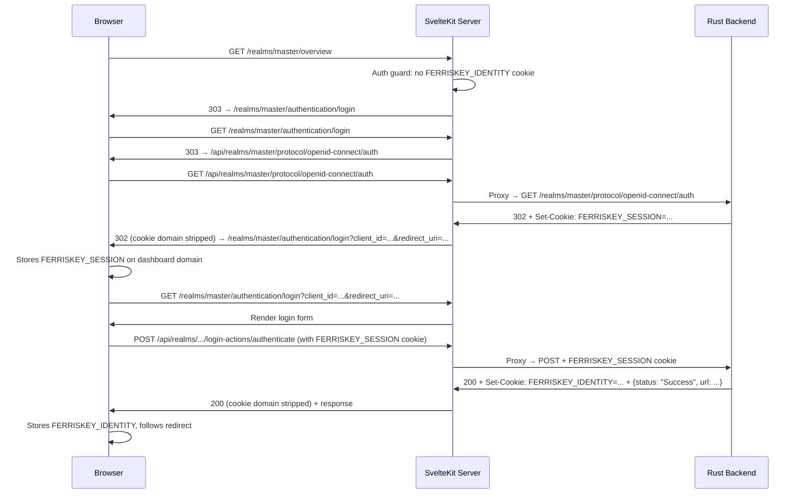

# FerrisKey Dashboard Migration: Analysis Report

## Executive Summary

The migration from the old React frontend (`front/`, 137 source files) to the new SvelteKit dashboard (`dashboard/`, 46 source files) is **~25-30% complete**. The new dashboard has a solid architectural foundation (SSR auth, app shell, API client, design system) but is missing most CRUD operations, several feature modules, and has a **critical login bug**.

---

## What is Done ✅

### Architecture & Infrastructure
| Feature | Status | Notes |
|---------|--------|-------|
| SvelteKit project setup | ✅ | Svelte 5 with `adapter-node` |
| Design system (CSS variables) | ✅ | Light/dark themes, glass-panel styling |
| App shell with sidebar | ✅ | Navigation, breadcrumbs, user profile |
| Server-side auth guard | ✅ | `(app)/+layout.server.ts` checks `FERRISKEY_IDENTITY` cookie |
| API client (`apiRequest`) | ✅ | Generic typed fetcher with error handling |
| Server-side data loading | ✅ | `loadRealmResource` helper with auth headers |
| TanStack Query setup | ✅ | Provider in root layout |
| Navigation config | ✅ | 3 groups: Core, Configuration, Security |
| Session parsing from JWT | ✅ | Client-side JWT decode in `session.ts` |
| Automatic session expiry | ✅ | `onMount` timeout in AppShell redirects on expiry |
| Logout link | ✅ | Points to backend OIDC logout endpoint |

### Pages (Data-Driven)
| Page | Status | Data Source | CRUD |
|------|--------|-------------|------|
| Login | ✅ | Backend `/login-actions/authenticate` | N/A |
| OTP challenge | ✅ | Placeholder UI only | N/A |
| Required action | ✅ | Placeholder UI only | N/A |
| Overview | ✅ | Real data: users, clients, roles | Read-only |
| Users | ✅ | Real data from API | **Read-only** (no create/edit/delete) |
| Clients | ✅ | Real data from API | **Read-only** (no create/edit/delete) |
| Roles | ✅ | Real data from API | **Read-only** (no create/edit/delete) |

### Pages (Hardcoded / Placeholder)
| Page | Status | Notes |
|------|--------|-------|
| SeaWatch | ⚠️ | UI shell with **hardcoded demo data** |
| Compass | ⚠️ | UI shell with **hardcoded demo data** |
| Client Scopes | ⚠️ | Uses `PagePlaceholder` component |
| Realm Settings | ⚠️ | Uses `PagePlaceholder` component |
| Identity Providers | ⚠️ | Uses `PagePlaceholder` component |
| User Federation | ⚠️ | Uses `PagePlaceholder` component |

### Reusable Components
- `AppShell`, `BrandLogo`, `ThemeToggle`, `MetricCard`, `SectionCard`
- `ChipTabs`, `LinearMeter`, `RingGauge`, `TrendAreaChart`
- `PagePlaceholder` (for modules not yet migrated)
- `ripple` action (material-style touch feedback)

---

## Critical Bug: Login Not Working 🐛

### Root Cause

The login flow requires **two cookies working in sequence across different origins**:

1. **Step 1 — OAuth initiation**: User visits dashboard → `+page.server.ts` redirects to **backend** `GET /realms/{realm}/protocol/openid-connect/auth`. The backend:
   - Creates an auth session
   - Sets `FERRISKEY_SESSION` cookie (on the **backend** domain `:3333`)
   - Redirects to `{webapp_url}/realms/{realm}/authentication/login?client_id=...&redirect_uri=...`

2. **Step 2 — The problem**: `webapp_url` in the backend defaults to `http://localhost:5555` (the **old React front** port). The SvelteKit dashboard runs on `:5173`. So the redirect goes to the wrong port.

3. **Step 3 — Cookie mismatch**: Even if the redirect port is fixed, the `FERRISKEY_SESSION` cookie was set by the backend on `:3333` with `path=/`. When the login form POSTs from the browser (`fetch` on `:5173`) to the backend on `:3333`, the browser **does send** the session cookie because `credentials: 'include'` is set and cookies are port-independent on `localhost`. However, the flow still breaks because:
   - The backend's response sets `FERRISKEY_IDENTITY` on the backend domain
   - The dashboard's server-side code reads `FERRISKEY_IDENTITY` from the **dashboard's cookies** (different cookie jar)

### Fix Required

> [!IMPORTANT]
> **This has been fixed.** See the "Login Fix Implementation" section below.

---

## Login Fix Implementation ✅

The fix uses a **SvelteKit server-side API proxy** so all cookies stay on one domain:

### Files Changed

| File | Change |
|------|--------|
| [hooks.server.ts](file:///home/nazrulkhan/Documents/Projects/Backend/ferriskey/dashboard/src/hooks.server.ts) | **[NEW]** API proxy: `/api/*` → backend, strips cookie domains, rewrites Location headers |
| [config.ts](file:///home/nazrulkhan/Documents/Projects/Backend/ferriskey/dashboard/src/lib/api/config.ts) | Default API base → `/api` on same origin |
| [login/+page.server.ts](file:///home/nazrulkhan/Documents/Projects/Backend/ferriskey/dashboard/src/routes/realms/[realm]/(auth)/authentication/login/+page.server.ts) | OAuth redirect through `/api` proxy |
| [AppShell.svelte](file:///home/nazrulkhan/Documents/Projects/Backend/ferriskey/dashboard/src/lib/components/AppShell.svelte) | Logout URL → `/api` proxy |
| [api/.env](file:///home/nazrulkhan/Documents/Projects/Backend/ferriskey/api/.env) | Added `WEBAPP_URL=http://localhost:5173` |
| [dashboard/.env](file:///home/nazrulkhan/Documents/Projects/Backend/ferriskey/dashboard/.env) | `PUBLIC_API_URL` → `BACKEND_URL` |

### How it Works

### Verification
- `svelte-check`: **0 errors, 0 warnings** ✅
- E2E test pending (requires running backend + dashboard)

---

## What is Missing ❌

### Missing from Old React Frontend

| Feature Module | Old Front Files | Dashboard Status |
|---------------|----------------|------------------|
| User CRUD (create, edit, delete) | 14 files | ❌ Missing |
| User detail page (credentials, roles, sessions) | 8 files | ❌ Missing |
| Client CRUD | 16 files | ❌ Missing |
| Client detail (settings, credentials, scopes, roles) | 12 files | ❌ Missing |
| Client Scopes full module | 8 files | ❌ Placeholder only |
| Role CRUD + permissions | 5 files | ❌ Missing |
| Realm management | 5 files | ❌ Placeholder only |
| Webhooks module | 4 files | ❌ **Entirely missing** |
| Trident (MFA) module | 6 files | ❌ **Entirely missing** |
| Credential management | 3 files | ❌ **Entirely missing** |
| Identity Providers | 3 files | ❌ Placeholder only |
| User Federation | 2 files | ❌ Placeholder only |
| SeaWatch (live API) | 2 files | ⚠️ Hardcoded data |
| Compass (live API) | N/A (new) | ⚠️ Hardcoded data |
| Realm switcher | 1 file | ❌ UI exists, no functionality |
| Global search | built-in | ❌ UI exists, not connected |
| Confirm delete dialogs | 1 file | ❌ Missing |
| API client types (shared) | 6 files | ❌ Each page defines types inline |

### Missing API Layer
- No centralized type definitions (each `+page.server.ts` defines its own inline types)
- No shared API response types
- No mutation helpers (POST/PUT/DELETE) for server actions
- No form action patterns for SvelteKit

### Missing UX Patterns
- No toast/notification system (old front used `sonner`)
- No confirmation dialogs for destructive actions
- No loading states/skeletons
- No error boundary pages
- No pagination
- No form validation UI (old front used `react-hook-form` + `zod`)

---

## Recommended Phased Approach

### Phase 1: Fix Login (Critical)
1. Configure `webapp_url` or proxy API through SvelteKit
2. Handle OAuth callback to set cookies properly
3. End-to-end test the full login flow

### Phase 2: Establish Patterns
1. Create shared type definitions
2. Add SvelteKit form actions for mutations
3. Add toast notification system
4. Add confirmation dialog component
5. Add loading states

### Phase 3: CRUD for Core Modules
1. Users: Create → Edit → Delete → Detail page
2. Clients: Create → Edit → Delete → Detail page
3. Roles: Create → Edit → Delete → Permission mapping

### Phase 4: Remaining Feature Modules
1. Client Scopes (CRUD + protocol mappers)
2. Realm Settings
3. SeaWatch (wire to real API)
4. Identity Providers
5. User Federation
6. Webhooks
7. Trident (MFA management)
